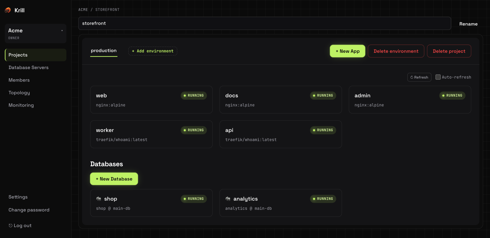
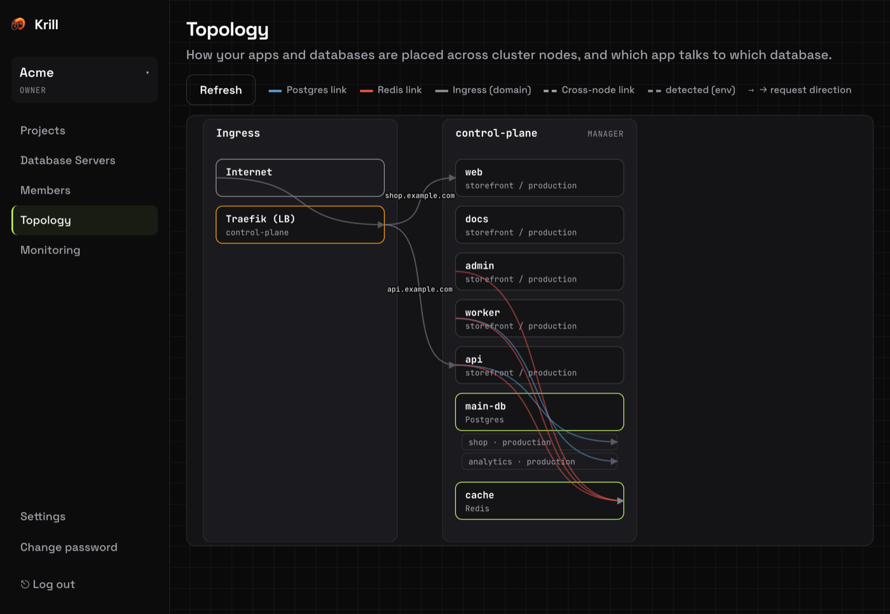
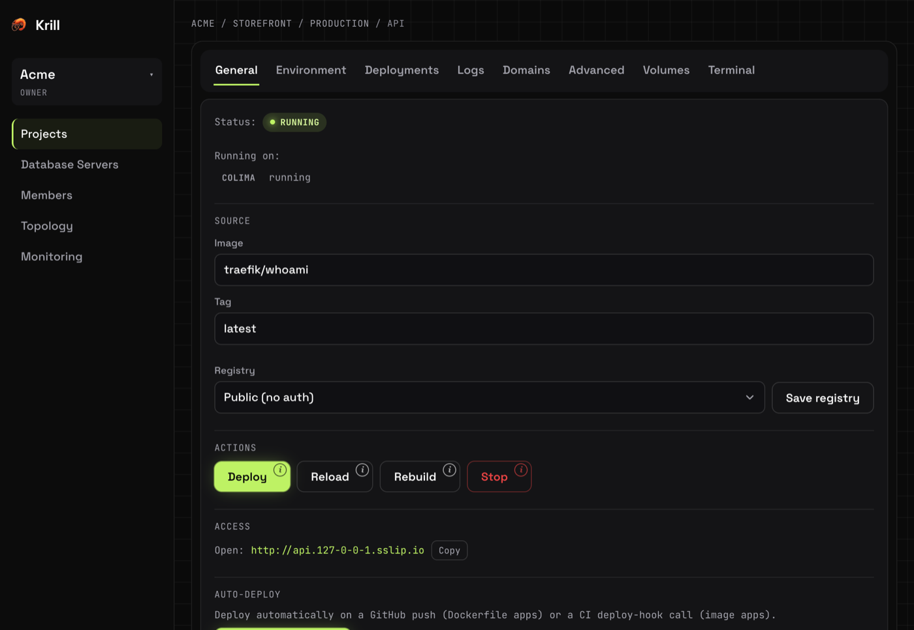

<div align="center">


# Krill

**A lightweight self-hosted PaaS on Docker Swarm.**<br>
Deploy apps and managed databases to your own servers from a single Go binary.

[](https://github.com/proshik/krill/actions/workflows/ci.yml)
[](https://github.com/proshik/krill/releases/latest)
[](go.mod)
[](LICENSE)

[Install](docs/install.md) · [Documentation](#documentation) · [Roadmap](ROADMAP.md)

</div>



## Why Krill

Krill started as a way to host a Telegram bot and a few small apps on a 2 vCPU / 2 GB VPS.
Existing self-hosted platforms do the job, but their control planes are heavy: Dokploy alone
took about **760 MB** of RAM on that box, more than any app it was running.

Krill is the same idea at a fraction of the weight: one compiled Go binary of about 20 MB, with
no Node.js, no SSR runtime and no agents on your servers. It uses Docker Swarm for scheduling
and Traefik for routing, and stores its state in Postgres.

## Features

- **Deploy from an image or a Dockerfile.** Build from a Git repository on the server, or pull
  a public or private image. Zero-downtime rolling updates, automatic rollback, deployment
  history with live build logs.
- **Managed databases.** Postgres, Redis, DragonFly and MinIO. One Postgres server holds
  separate databases for each environment, and linked apps get connection values injected on
  every deploy.
- **Backups to S3.** Scheduled Postgres and volume backups with retention, restored from the
  UI. → [Backups](docs/guides/backups.md)
- **Domains and HTTPS.** Custom domains with per-domain Let's Encrypt certificates. Apps are
  internal until you expose them, and a domain can publish only some paths or sit behind basic
  auth and an IP allowlist. → [Domains](docs/guides/domains.md)
- **Container settings.** CPU and memory limits, replicas, healthchecks, volumes, command
  override, raw TCP/UDP ports, build arguments and secrets.
- **Operations.** Structured live logs, a web terminal, CPU and memory charts per node,
  Telegram alerts, and a map of which app runs where and talks to which database.
- **Multiple servers.** Join worker nodes over SSH, pin apps to nodes or run them everywhere,
  move a database to another node with its data, lock every node down with a firewall.
- **Automation.** GitHub push-to-deploy, a CI deploy hook, a REST API and an MCP server for
  AI agents, and `krill-cli` to build locally and deploy. →
  [API](docs/guides/agent-api.md) · [CLI](docs/guides/krill-cli.md)
- **Teams.** Organizations, projects and environments with owner, admin and member roles.
  Every organization runs on its own network; stored credentials are encrypted at rest. The UI
  is in English and Russian.

## Quick start

On a fresh Linux server (amd64 or arm64):

```sh
curl -sSL https://raw.githubusercontent.com/proshik/krill/master/install.sh | sudo sh
```

The installer sets up Docker and Swarm, Postgres for Krill's state and a systemd service,
verifies the downloaded binary against the release checksums, and prints the URL and a
one-time admin password. Re-run it to upgrade.

Options, external Postgres, HTTPS for the UI and uninstalling are covered in
[Installing Krill](docs/install.md).

## Screenshots

| Topology | App |
|:---:|:---:|
|  |  |

## Status

Krill is **pre-1.0**. It runs the author's own projects, but it is not yet hardened for anyone
else's production:

- **No high availability.** One control plane on one node; if that node goes down, the UI and
  the ingress go with it.
- **Krill's own database is not backed up automatically.** Back it up yourself, or install
  against a managed Postgres.
- **Some features are verified in tests but not yet on a live cluster.**

[ROADMAP.md](ROADMAP.md) lists what is done, what awaits live verification and what is planned.

## Documentation

| Guide | Covers |
|-------|--------|
| [Installing Krill](docs/install.md) | Install, upgrade, external Postgres, uninstall. |
| [Configuration](docs/configuration.md) | Every `KRILL_*` setting. |
| [Domains, HTTPS and access control](docs/guides/domains.md) | Custom domains, certificates, path exposure, basic auth, IP allowlists, raw ports. |
| [Backups](docs/guides/backups.md) | S3 storage, schedules, retention, restore. |
| [Private images and repositories](docs/guides/registries.md) | Registries, private Git, build arguments and secrets. |
| [Agent and CI API](docs/guides/agent-api.md) | REST, MCP, tokens, webhooks. |
| [krill-cli](docs/guides/krill-cli.md) | Build on your machine, deploy to Krill. |
| [Architecture](docs/architecture.md) | How it fits together, data model, source layout. |
| [Development](docs/development.md) | Run from source, tests, releases. |

## Contributing

Bug reports, ideas and pull requests are welcome — start with
[CONTRIBUTING.md](CONTRIBUTING.md). To report a vulnerability, follow
[SECURITY.md](SECURITY.md) rather than opening a public issue.

## License

[MIT](LICENSE)
